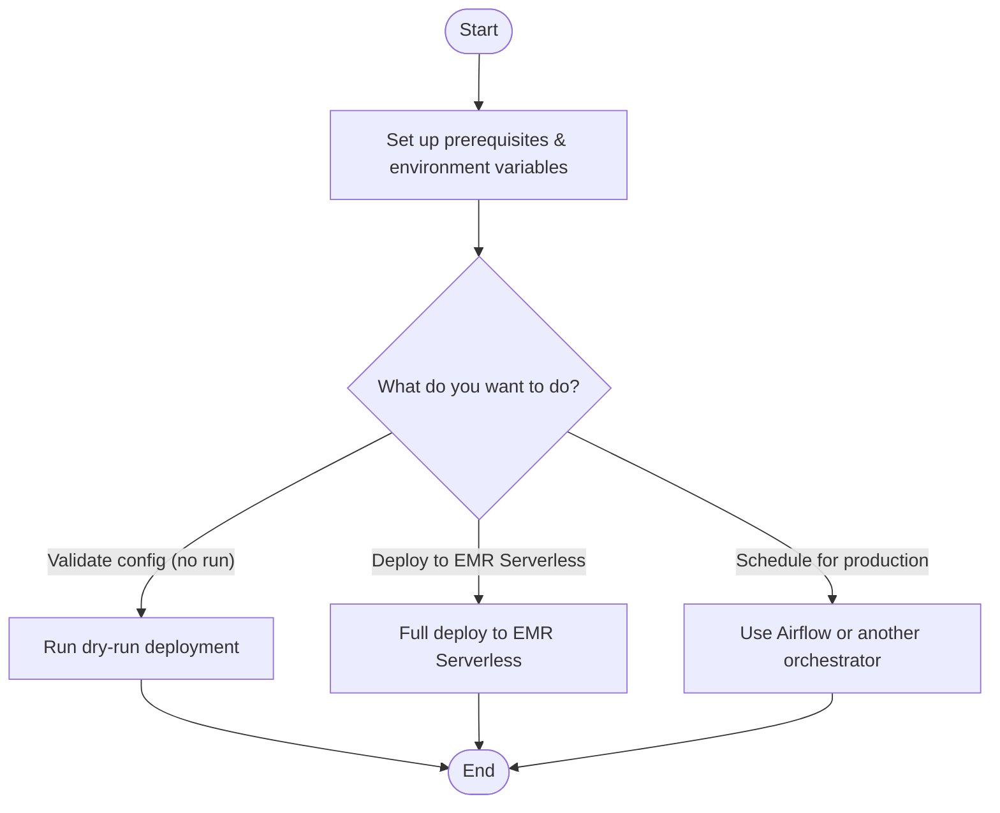

# emr-serverless-pyspark-uv-rap-template

[](https://github.com/astral-sh/uv)
[](https://github.com/astral-sh/ruff)
[](https://github.com/psf/black)

A tiny **PySpark** job packaged with **uv** (PEP 621) and a built-in CLI to deploy to
**EMR Serverless** 🚀

---

## **🏗️ Infrastructure Setup with Terraform**

Before you can deploy the application, you need to provision the necessary AWS
resources. This project uses Terraform to manage this infrastructure as code.

For a complete guide on setting up the S3 buckets, ECR repository, and IAM roles
-- with Terraform --
please see the [**Infrastructure Setup with Terraform Guide**](https://github.com/dombean/emr-serverless-pyspark-uv-rap-template/blob/main/docs/terraform_guide.md).

If you want to manually create IAM roles and policies, or need a detailed overview of
the required permissions for EMR Serverless, CloudWatch logging, and Apache Iceberg
integration, see the [**EMR Serverless, CloudWatch & Iceberg Setup Guide**](https://github.com/dombean/emr-serverless-pyspark-uv-rap-template/blob/main/docs/emr_serverless_guide.md).

---

## 🐛 Live Remote Debugging & 📓 EMR Studio (Optional)

Two optional capabilities, both off by default and enabled with a Terraform flag:

  - **Live remote debugging** -- set breakpoints in PyCharm or VS Code and step
    through the Spark driver running on EMR Serverless, via a reverse SSH tunnel
    through an SSM bastion
    (`terraform apply -var enable_remote_debugging=true`, then
    `uv run deploy-to-emr --package --submit --debug`). See the
    [**Remote Debugging Guide**](https://github.com/dombean/emr-serverless-pyspark-uv-rap-template/blob/main/docs/remote_debugging_guide.md).
  - **EMR Studio** -- the web-based notebook IDE for interactive development,
    provisioned with everything it needs (VPC, security groups, service role)
    via `terraform apply -var enable_emr_studio=true`. Set
    `EMR_STUDIO_ENABLED=true` before `--create-app` so the application accepts
    notebook sessions. See the
    [**Terraform Guide**](https://github.com/dombean/emr-serverless-pyspark-uv-rap-template/blob/main/docs/terraform_guide.md)
    for setup, costs, and required user permissions.

Both share one VPC and NAT gateway (~$0.05/hour while enabled) -- flip the flags
back to `false` when idle.

---

## 📺 Recommended Tutorial

If you're new to **EMR Serverless**, check out this helpful YouTube tutorial:
[Getting Started with EMR Serverless (YouTube)](https://www.youtube.com/watch?v=grfSNj2EMwo)

The GitHub repository used in the tutorial can be found here:
[johnny-chivers/emr-serverless](https://github.com/johnny-chivers/emr-serverless)

---

## 🧐 Why This Works

We upload **two artifacts** to S3 for each deploy:
1. `main.py` → used as the Spark **`entryPoint`** (S3 URI)
2. `code_*.zip` → added via **`--py-files`** (S3 URI)
   Spark automatically adds the **ZIP root** to `PYTHONPATH`.

📦 The pack step copies **`src/` contents into the ZIP root**, so imports like
`import emr_dummy` work on the cluster without extra setup.

---

## 📦 The "Image + Zip" Model: A Common Gotcha

A frequent point of confusion with EMR Serverless is why you need both a
**Docker image** and a **zip file** of your code in S3.
Here’s a clear breakdown of their roles:

### 1. The Docker Image (The Environment)
- **What it is**: A self-contained environment with the operating system, Python,
  and all your heavy third-party dependencies (like `pandas`, `pyspark`, `boto3`)
  installed via `uv`.
- **When to build**: You only need to build and push a new image when
  your `pyproject.toml` or `uv.lock` file changes.
- **Purpose**: Provides a stable, reproducible, and quickly-startable
  runtime for your job.

### 2. The S3 Zip File (Your Application Code)
- **What it is**: A lightweight archive containing only your application's
  source code (i.e., the contents of your `src` directory).
  **It should NOT contain any dependencies.**
- **When to build**: This is created and uploaded on every single deployment.
- **Purpose**: Allows for rapid iteration. You can change your Python logic and
  redeploy in seconds without waiting for a multi-minute Docker build.

### How EMR Serverless Combines Them
At runtime, EMR Serverless performs these steps:
1. Starts a container from your specified **Docker Image**.
2. Downloads your `code.zip` and `main.py` from S3.
3. Places the contents of the zip file onto the `PYTHONPATH`.
4. Executes your `main.py` entry point.

This separation is powerful: you get the stability of a Docker image for your
environment and the speed of a simple file upload for your code.

---

## 🛠 Prerequisites

- 🐍 **Python 3.10** (required for EMR 6.x + PySpark 3.5 compatibility)
- 📦 `uv` installed (e.g. `brew install uv`)
- 🔑 AWS CLI with credentials configured (`aws configure` or `aws sso login`)
- ☁️ An **EMR Serverless** application created in AWS

---

## 🧭 Developer Workflow

The diagram below shows the main paths a developer can take after setting up
prerequisites and environment variables.



**Related Sections In This README:**

  - [Dry-Run Mode](https://www.google.com/search?q=%23-dry-run-mode)
  - [Deploy to EMR Serverless](https://www.google.com/search?q=%23-deploy-to-emr-serverless)
  - [Notes](https://www.google.com/search?q=%23-notes)

---

## 🚀 A Template For Reproducible Analytical Pipelines (RAP)

This repository is designed to serve as a template for building
**Reproducible Analytical Pipelines (RAP)** for PySpark on AWS EMR Serverless.

RAP is a methodology for data analysis that incorporates software engineering best
practices to create processes that are
**reproducible, auditable, efficient, and high-quality**.
The goal is to automate analytical pipelines from end-to-end, minimising
manual steps and maximising trust in the results.

This project embodies the core principles of RAP:

  - **📦 Environment Reproducibility**: The `Dockerfile` and `uv.lock` file guarantee
  a consistent, reproducible environment with pinned dependencies for every job run.
  - **🤖 Automation**: The `deploy-to-emr` CLI script automates the entire deployment
  process—packaging code, managing infrastructure, and submitting jobs—eliminating
  manual, error-prone steps.
  - **🔍 Auditability**: By using version control (like Git) and the immutable,
  versioned S3 layout for artifacts, every deployment creates a full audit trail.
  The generated `manifest.json` links a specific code version to the exact
  artifacts used in a run.
  - **✅ Quality Assurance**: The structure encourages modern development practices
  like code linting, testing, and peer review through pull requests, leading to
  higher-quality analysis code.
  - **📖 Embedded Documentation**: Code is well-commented, and documentation is
  included and version-controlled within the project itself.

By using this template, you can build robust, production-ready PySpark data
pipelines that are efficient, transparent, and easy to maintain.

### Sources

  - [Good RAP - Arthur Turrell](https://aeturrell.com/blog/posts/public-sector-analytical-efficiency/#good-rap)
  - [Reproducible Analytical Pipelines (RAP) - Government Analysis Function](https://analysisfunction.civilservice.gov.uk/support/reproducible-analytical-pipelines/)

---


## 🏗 First-Time Local Setup

```bash
uv venv
source .venv/bin/activate   # macOS/Linux
# Windows:
# .venv\Scripts\activate

# Install with dev extras so PySpark works locally
# (Cluster already has PySpark — no need to ship it)
uv pip install -e ".[dev]"
```

💡 **Tip:** `uv` is fast -- dependency resolution and installs are
near-instant compared to `Poetry` or `pip`.

---

## 🌍 Environment Variables

Set these in your shell or a `.env` file (we auto-load it):

```bash
REGION=eu-west-2
S3_BUCKET=your-artifacts-bucket
EMR_APP_ID=00fulej7qh7jt90t
EMR_EXECUTION_ROLE=arn:aws:iam::<your-aws-account-id>:role/YourEmrServerlessExecutionRole
DEPLOY_ENV=dev   # optional, used in S3 prefix
IMAGE_URI=<your-aws-account-id>.dkr.ecr.eu-west-2.amazonaws.com/emr-pyspark:7.9.0
APP_NAME=emr-spark-uv
RELEASE_LABEL=emr-7.9.0
```

⚠️ **Important:**

  - `EMR_EXECUTION_ROLE` must be an **IAM Role ARN** EMR Serverless can assume.
  - Do **NOT** use the “Application ARN” -- it will fail with a `ValidationException`.

---

## 🗒 Notes

  - PySpark is a **dev dependency** only -- EMR Serverless clusters already include it.
  - Use env vars instead of hardcoding for portability and security.
  - **For production deployments** 🚀 -- it’s recommended to orchestrate EMR Serverless job
    runs using a workflow scheduler such as **[Apache Airflow](https://airflow.apache.org/)**.
      - Airflow can trigger this CLI or use the `boto3` EMR Serverless API directly.
      - Benefits include:
          - Automatic retries & failure alerts
          - Dependency management between multiple jobs
          - Scheduling and SLA monitoring

---

## 📤 Deploy To EMR Serverless

You can now run the entire deployment process with a single command, or
select specific steps.

**Full Deploy (Build Image, Create App, Package, and Submit):**

```bash
uv run deploy-to-emr
```

**Run Specific Steps:**

```bash
# Build and push the Docker image
uv run deploy-to-emr --build-image

# Create or update the EMR Serverless application
uv run deploy-to-emr --create-app

# Package the application and upload to S3
uv run deploy-to-emr --package

# Submit the job to EMR Serverless
uv run deploy-to-emr --submit
```

### What Happens During Deployment:

1.  **Build & push Docker image** with your dependencies.
2.  **Create or update EMR Serverless application** with the new image.
3.  **Build & package** your Python code and dependencies into a `.zip`
    ready for Spark (`--py-files`).
4.  **Upload artifacts** (`main.py` and the `.zip`) to a **versioned, immutable**
    S3 release folder.
5.  **Generate a manifest** (`manifest.json`) capturing package metadata,
    Python version, and artifact paths.
6.  **Submit job** via AWS `StartJobRun` API to EMR Serverless.

### When To Use:

  - ✅ Full end-to-end run in the actual EMR Serverless environment.
  - ✅ Validate packaging, dependency resolution, and S3 artifact uploads.
  - ✅ Use before production runs to ensure parity with live infrastructure.

💡 **Tip:** for production scheduling, consider using **Apache Airflow** or another
orchestrator to trigger this command as part of a managed pipeline.

---

## 🧹 Cleaning Up Resources

To avoid incurring ongoing AWS charges, you can easily stop and delete the
EMR Serverless application when you are finished.

```bash
uv run deploy-to-emr --cleanup
```

This command will:

1.  **Stop** the EMR Serverless application.
2.  **Wait** for it to fully stop.
3.  **Delete** the application permanently.
4.  **Remove** the local `.emr_app_id` file.

The command uses the `EMR_APP_ID` from your `.env` file or falls back to
the `.emr_app_id` file created by the `--create-app` step.

---

## 📝 Optional Deployment Note

You can tag your deployment with a human-readable note:

```bash
uv run deploy-to-emr --deployment-note "Testing new partitioning logic"
```

📜 This `deployment-note` is saved in `manifest.json` alongside:

  - Package version
  - Python version
  - Original entry-point name
  - Exact S3 keys used for this deploy

💡 **Why it’s useful:**

  - Perfect for **audit trails** 🕵️
  - Makes it easier to roll back or investigate a deployment
  - Great for CI/CD tagging

---

## 🧪 Dry-Run Mode

Preview the exact AWS `StartJobRun` payload **without actually submitting the job**
to EMR Serverless. This is useful for validating all arguments, environment variables,
and generated S3 artifact paths before launching.

```bash
uv run deploy-to-emr --dry-run
```

### What Happens In Dry-Run Mode:

1.  **Normal packaging steps still occur** -- your code and dependencies are staged
    exactly as in a real deploy, ensuring the S3 paths will be correct.
2.  **Payload is constructed** -- the script generates the JSON body
    for `boto3.client("emr-serverless").start_job_run(...)`.
3.  **No API call is made** -- instead of submitting to AWS, the payload is
    pretty-printed to the console via the logger.

### Example Output:

```json
{
  "applicationId": "00fulej7qh7jt90t",
  "executionRoleArn": "arn:aws:iam::<your-aws-account-id>:role/YourEmrServerlessExecutionRole",
  "executionTimeoutMinutes": 60,
  "jobDriver": {
    "sparkSubmit": {
      "entryPoint": "s3://my-bucket/emr-code/emr_pyspark_dummy/dev/releases/20250808_123456-ab12cd34/main_ab12cd34.py",
      "entryPointArguments": [],
      "sparkSubmitParameters": "--py-files s3://my-bucket/emr-code/emr_pyspark_dummy/dev/releases/20250808_123456-ab12cd34/code_ab12cd34.zip"
    }
  },
  "configurationOverrides": {}
}
```

### When To Use:

  - ✅ Validate CLI arguments & environment variables before an actual run.
  - ✅ Confirm S3 artifact paths -- ensures your release folder and file names
    match expectations.
  - ✅ Debug or share payload details for change approval or troubleshooting without
    triggering a real cluster run.
  - ❌ No execution -- this mode does not run your Spark job or incur
    EMR runtime costs -- purely for inspection.

💡 **Tip:** Use dry-run mode in CI pipelines to validate that deployment scripts
and environment settings are correct before allowing production runs.

---

## 📦 How Packaging Works

1.  Compile dependencies via `uv pip compile` from `pyproject.toml`.
2.  Install into a **staging folder**.
3.  Copy `src/` package + `main.py` to staging root.
4.  Zip → upload to S3.

Example ZIP structure:

```
code_<deployment_id>.zip
├── emr_dummy/
│   ├── __init__.py
│   └── job.py
└── main_<deployment_id>.py
```

---

## 📂 S3 Layout (Versioned + Immutable)

Every deployment gets a unique `deployment_id`:

```
s3://<bucket>/emr-code/<package>/<env>/
├── releases/
│   └── 20250808_123456-ab12cd34/
│       ├── code_20250808_123456-ab12cd34.zip
│       ├── main_20250808_123456-ab12cd34.py
│       └── manifest.json
└── logs/
    └── 20250808_123456-ab12cd34/
```

### Benefits:

1.  ✅ **Immutable releases** -- every `main.py` matches its `code.zip`
2.  ✅ **Full audit trail** -- each `manifest.json` contains:
      - `package_name`, `package_version`, `python_requires`, `python_version`
      - S3 URIs of all artifacts
      - Optional `deployment_note`

---

## 💡 Tips For Robustness

  - Always **use a deployment note** in production for traceability.
  - Store `.env` in a **secure location**, not in Git.
  - Use `--dry-run` in CI to lint deployments without launching jobs.
  - Use different `DEPLOY_ENV` values (`dev`, `staging`, `prod`) to avoid mixing releases.

## 📄 Environment Variables (Quick Start)

Copy the example file and edit it:

```bash
cp .env.example .env
```

Then set `REGION`, `S3_BUCKET`, `EMR_APP_ID`, `EMR_EXECUTION_ROLE`, and
optional `DEPLOY_ENV`/`DEPLOYMENT_NOTE`.

---

## 📊 CloudWatch Logging

EMR Serverless job submissions now enable **CloudWatch Logs** by default.

Control this via your `.env`:

```bash
ENABLE_CLOUDWATCH_LOGGING=true  # default
```

Logs are still written to the S3 `log_uri` as before.

💡 **Tip:** Toggle CloudWatch logging from the CLI:

```bash
uv run deploy-to-emr --enable-cw   # or --no-enable-cw
```

---

## 🧊 Apache Iceberg (Glue Catalog)

The bundled job writes a tiny DataFrame to an **Apache Iceberg** table backed
by **AWS Glue Catalog** and S3.

### ⚙️ Configure

Add the following to your `.env` (see `.env.example`):

```bash
ICEBERG_CATALOG_NAME=glue_catalog
ICEBERG_GLUE_DB=your_glue_database
ICEBERG_S3_BUCKET=your-data-bucket
# Optional override (otherwise derived from bucket):
# ICEBERG_WAREHOUSE_PATH=s3://your-data-bucket/iceberg/warehouse
```

A sample `config.toml` is included to mimic a future config-driven workflow.
The table name comes from `config.toml` (e.g. `dom_iceberg_table`).

### 📦 Where Do The Spark Iceberg Configs Live?

All Spark catalog configs are set **via `--conf` in the EMR Serverless job
submission payload** for portability and environment standardisation.

**Best practice:** Centralise these settings in the deploy payload so they’re
auditable per deployment.

### 🚀 How Configuration Is Passed On EMR Serverless

Environment variables from your local `.env` are **not** automatically
visible to the EMR Serverless driver.

The deploy CLI reads your local `.env` and injects values as
Spark `--conf` keys (e.g. `spark.emr_dummy.ICEBERG_GLUE_DB`).

The job reads them via `spark.conf`, with environment variables as a fallback.

---

### 🔧 Runtime Configuration Summary

  - Iceberg Spark configs are passed via the EMR Serverless submit payload (`--conf`).
  - The job reads:
      - `spark.emr_dummy.ICEBERG_CATALOG_NAME` (defaults to `glue_catalog` if not provided)
      - `spark.emr_dummy.ICEBERG_GLUE_DB` (**required**)
      - `table_name` from packaged `config.toml`.

### Simplified Environment

Use **S3_BUCKET** only. Scripts derive code/log prefixes like:

  - `s3://$S3_BUCKET/jobs/$APP_NAME/`
  - `s3://$S3_BUCKET/logs/$APP_NAME/`

## ✅ Environment Variables (aligned with .env.example)

```dotenv
REGION=eu-west-2
S3_BUCKET=my-artifacts-bucket
EMR_APP_ID=00fulej7qh7jt90t
EMR_EXECUTION_ROLE=arn:aws:iam::<your-aws-account-id>:role/YourEmrServerlessExecutionRole
APP_NAME=emr-spark-uv
RELEASE_LABEL=emr-7.9.0
DEPLOY_ENV=dev
```

  - `EMR_APP_ID` is the **EMR Serverless Application ID** from the AWS Console.
  - `EMR_EXECUTION_ROLE` is the **IAM Execution Role ARN** that jobs assume (not the application ARN).
  - Scripts auto-derive paths:
      - Code zips → `s3://$S3_BUCKET/jobs/$APP_NAME/`
      - Logs → `s3://$S3_BUCKET/logs/$APP_NAME/` (override with `S3_LOG_PREFIX`)

## 📄 Environment Setup

Copy `.env.example` to `.env` and fill in values for your account.

### Do I Need EMR_APP_ID?

  - **No, if you let the scripts create the app.**
    Run `uv run deploy-to-emr --create-app` and we’ll save the resulting ID to a
    local file `.emr_app_id`.
  - **Yes, if you want to reuse an existing app** created in the AWS Console.
    Put its ID into `.env` as `EMR_APP_ID`.

The submission script will use `EMR_APP_ID` from `.env` **if set**, otherwise
it falls back to reading `.emr_app_id`.

### Minimal Required Variables

At minimum you need:

  - `REGION` — AWS region (e.g., `eu-west-2`)
  - `S3_BUCKET` — bucket for artifacts/logs
  - `EMR_EXECUTION_ROLE` — **Execution Role ARN** for EMR Serverless
  - `IMAGE_URI` — your custom ECR image (bakes your Python deps)
  - (optional) `APP_NAME`, `RELEASE_LABEL`, `DEPLOY_ENV`, `S3_LOG_PREFIX`

See `.env.example` for a complete, commented template.

---

## 🔁 End-to-End Workflow

```bash
# Build & push custom image (from Dockerfile)
uv run deploy-to-emr --build-image

# Package code (zip main.py + src/) and upload to s3://$S3_BUCKET/jobs/$APP_NAME/
uv run deploy-to-emr --package

# Create/reuse EMR Serverless app and persist its ID to .emr_app_id
uv run deploy-to-emr --create-app

# Submit a job using the latest uploaded zip
uv run deploy-to-emr --submit

# Or do everything at once:
uv run deploy-to-emr
```

---

## 🧪 Iteration Tips

  - **Change Python code?** Run `uv run deploy-to-emr --package --submit` to re-zip
    and re-run quickly.
  - **Change dependencies?** Rebuild the image:
    `uv run deploy-to-emr --build-image`, then `uv run deploy-to-emr --submit`.
  - **Switching between apps?** Set `EMR_APP_ID` in `.env` or
    swap `.emr_app_id` locally.

---

## 🛡️ Licence

Unless stated otherwise, the codebase is released under the [MIT License][mit].
This covers both the codebase and any sample code in the documentation.

[mit]: LICENSE
