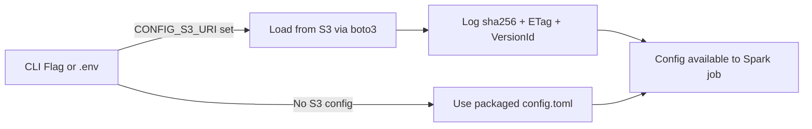

# 🗂️ Business Workflow — Config in S3 with Local Fallback

A **lightweight, non-technical playbook** for keeping configs **auditable**,
**versioned**, and **tied to specific code releases**, with automatic fallback
to packaged defaults.

---

## 🔄 How Config Loads at Runtime



---

## 📌 Store Configs in a Stable Location

Use a consistent key so jobs always know where to find the latest config:
```
s3://my-biz-configs/<env>/<pipeline>/config.toml
```

If you generate date-stamped configs, **also** upload the same file
to `.../config.toml` as a stable alias.

---

## 📌 Version by Release

On each deploy, copy the config to a **release folder** and pass that exact object
to the job:
```
s3://my-biz-configs/<env>/<pipeline>/releases/<deployment_id>/config.toml
```
Then set `--config-s3` (or `CONFIG_S3_URI`) to that URI -- this couples config
to the specific code build.

---

## 📄 Example `config.toml`

```toml
[general]
pipeline_name = "dom-pipeline"
input_path = "s3://my-raw-bucket/data/"
output_path = "s3://my-processed-bucket/results/"

[processing]
max_partitions = 200
enable_deduplication = true
```

---

## 📋 Production Checklist

- ✅ Config uploaded to correct path & accessible by EMR role.
- ✅ Bucket versioning enabled.
- ✅ `sha256` and `ETag` logged on deploy.
- ✅ CHANGELOG updated with what changed and why.
- ✅ Validation schema matches config file.

---

## ⚠️ Common Pitfalls
- **Wrong prefix** — `s3://` included twice in path will cause a `404`.
- **IAM perms missing** — Ensure `s3:GetObject` and `s3:GetObjectVersion` are allowed
  for the EMR role.
- **Cached packaged config** — If S3 config isn’t being picked up,
  check `--config-s3` or `.env` is being read in EMR.

---

## 📥 Running with Config from S3

**Option 1 — CLI flag (highest priority)**
```bash
uv run deploy-to-emr --config-s3 s3://my-biz-configs/prod/dom/config.toml
```

**Option 2 — `.env` file**
```bash
# .env
CONFIG_S3_URI=s3://my-biz-configs/prod/dom/config.toml
```
Then run:
```bash
uv run deploy-to-emr
```

---

## ⚙️ Runtime Behaviour

1. If `--config-s3` or `CONFIG_S3_URI` is set → Fetch from S3, parse TOML
   in-memory, log `sha256`/`ETag`/`VersionId`.
2. Otherwise → Use packaged `config.toml` from `emr_dummy` module.
3. Config is broadcast to executors as needed.
